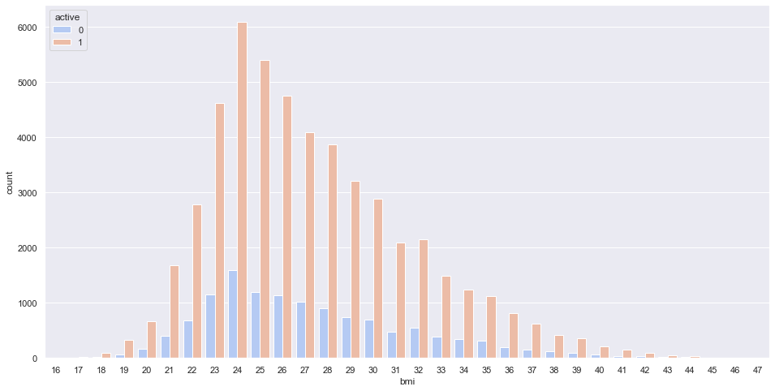
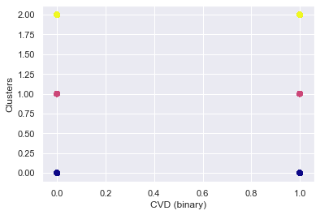

# [Project 1: CNN model for Fruit Image Classification : Project Overview](https://github.com/Nitish950/CNN-model-for-multi-class-classification-using-Python-tensorflow)

* CNN model created using maxpooling, convolutional,dropout and flatten layers
* Accuracy of 99.7% achieved  
* Visualization of loss and accuracy
* Heatmap visualization of the filters and convolutional layers

# [Project 2: Exploratory analysis of Methane Emission data by World Bank : Project Overview](https://github.com/Nitish950/Methane-Emission-EDA)

* Imported the data using Pandas
* Dataframe characteristics
* Subsetting the Dataframe
* Conditional Subsetting
* Data Cleaning
* Data Exploration : Exploring data through scatter plots, histograms, bar graphs
* Created an interactive searchable widget

# [Project 3: Predictive analysis of historical Netflix Stock Price : Project Overview](https://github.com/Nitish950/Predictive-analysis-of-Netflix-stock-data)

* Carried out  data exploration and visualization
* Made models using RNN and LSTMs 
* Created training and testing dataset
* Optimized the training data using regression

# [Project 4: EDA and regression analysis of graduate admission data : Project Overview](https://github.com/Nitish950/EDA-and-regression-analysis-of-admission-data)

* Imported the data of 500 students
* Used pandas, sklearn, numpy and matplolib libraries
* Explored the relationship between various factors such as GRE and TOEFL scores were studied along with university rating
* Optimized linear and random forest regressors to suit the best model
* Most influential parameters were determined using regression (Linear and RandomForest) analysis

# [Project 5: Clustering and EDA of Cardiovascular disease data : Project Overview](https://github.com/Nitish950/Clustering-and-EDA-of-Cardiovascular-Disease-)

* Worked with pandas to carry out initial analysis
* Carried out data cleaning by removing outliers and incorrect data
* Used seaborn and matplotlib libraries for visualization
* Utilized Sklearn and KMeans for clustering of the dataset
* Calculated BMI and it's relation with CVD and age
* Established relation between CVD and alcohol consumption in males and females

